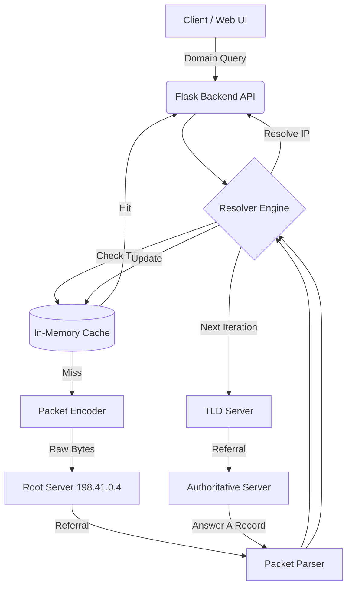
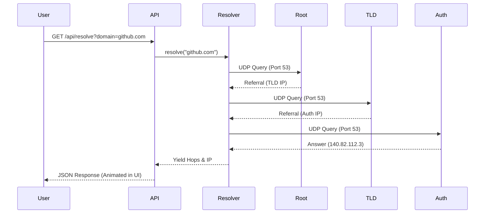

<div align="center">


<a href="https://git.io/typing-svg"></a>

<br/>


[](https://github.com/AyushGU12/WALK_THE_WIRE/stargazers)
[](https://github.com/AyushGU12/WALK_THE_WIRE/network)
[](https://github.com/AyushGU12/WALK_THE_WIRE/issues)
[](https://opensource.org/licenses/MIT)

</div>

<br/>

## 📖 Professional Overview

**Walk The Wire** is an iterative DNS resolver built entirely from scratch in Python. It completely eschews external DNS libraries, instead manually constructing binary query packets, dispatching them via raw UDP sockets, and decoding the byte-level responses (including complex compression pointer handling). It programmatically walks the DNS hierarchy from root servers to top-level domain (TLD) servers, all the way down to the authoritative nameservers. 

A sleek, premium single-page application (SPA) frontend built on Flask brings the terminal experience to the web, dynamically animating the resolution hops in a beautiful glassmorphism UI.

### 🌟 Why This Project Stands Out
- **Zero-Dependency Core**: Proves profound knowledge of the DNS wire format, byte manipulation (`struct`), and low-level networking protocols.
- **Iterative Walk**: Implements iterative resolution natively, mimicking how large-scale recursive resolvers operate behind the scenes.
- **Production-Ready Visuals**: Seamlessly integrates a backend API with a meticulously animated, dark-mode terminal UI.
- **Robustness**: Gracefully manages `CNAME` chains, `NXDOMAIN` edge-cases, and malformed referrals with built-in infinite-loop protection.

---

## 🏛️ System Architecture

Walk The Wire utilizes a modular, layered architecture ensuring a clean separation of concerns between byte-encoding, packet parsing, and network traversal.

### Data Flow Diagram


### Request Lifecycle


---

## 🚀 Features

### ✅ Completed
- **Byte-level Encoder/Decoder**: Manually packs and unpacks standard DNS packet headers and payloads.
- **Pointer Compression Handling**: Efficiently decodes `0xC0` offset pointers without infinite loops.
- **Iterative Resolution Engine**: Follows NS glue records autonomously.
- **Caching Mechanism**: TTL-respecting in-memory datastore.
- **Premium Web UI**: Terminal-styled SPA with real-time hop animation and glowing glassmorphism.
- **CLI Interface**: Detailed step-by-step terminal trace.

### 🔄 In Progress
- **IPv6 (AAAA) Resolution**: Extending A record support to AAAA.
- **Dockerization**: Containerizing the Flask application for 1-click deployments.

### 📌 Planned
- Multi-threading support for concurrent domain resolutions.
- Redis integration for distributed caching.

---

## 📁 Project Structure

```text
📦 WALK_THE_WIRE
 ┣ 📂 src
 ┃ ┣ 📂 static
 ┃ ┃ ┣ 📜 app.js         # Frontend Logic & Animation
 ┃ ┃ ┣ 📜 index.html     # SPA Layout
 ┃ ┃ ┗ 📜 style.css      # Premium Dark Theme
 ┃ ┣ 📜 __init__.py
 ┃ ┣ 📜 cache.py         # TTL In-Memory Store
 ┃ ┣ 📜 encoder.py       # Binary Packet Builder
 ┃ ┣ 📜 main.py          # CLI Entry Point
 ┃ ┣ 📜 parser.py        # Byte Decoder
 ┃ ┣ 📜 resolver.py      # Core Traversal Engine
 ┃ ┗ 📜 web.py           # Flask Backend API
 ┣ 📂 tests
 ┃ ┣ 📜 __init__.py
 ┃ ┣ 📜 test_encoder.py  # Unit Tests
 ┃ ┗ 📜 test_parser.py   # Integration Tests
 ┣ 📜 requirements.txt
 ┗ 📜 README.md
```

---

## ⚙️ Installation & Setup

### Prerequisites
- Python 3.8+
- Git

### Local Setup
1. **Clone the repository**
   ```bash
   git clone https://github.com/AyushGU12/WALK_THE_WIRE.git
   cd WALK_THE_WIRE
   ```

2. **Install dependencies**
   ```bash
   pip install -r requirements.txt
   ```

3. **Run the CLI Version**
   ```bash
   python src/main.py github.com google.com
   ```

4. **Run the Web Application**
   ```bash
   python src/web.py
   ```
   Navigate to `http://127.0.0.1:5000` to view the UI.

---

## 📡 API Documentation

### Resolve Domain
`GET /api/resolve`

**Parameters:**
- `domain` (string, required) - The domain name to resolve.

**Response (200 OK):**
```json
{
  "domain": "github.com",
  "elapsed": "0.450s",
  "ip": "140.82.112.3",
  "trace": [
    "  Resolving: github.com",
    "  [Step 1] → 198.41.0.4",
    "    → Referred to l.gtld-servers.net (192.41.162.30) [glue]",
    "  [Step 2] → 192.41.162.30",
    "    → Referred to ns-421.awsdns-52.com (205.251.193.165) [glue]",
    "  [Step 3] → 205.251.193.165",
    "    ✓ Answer: github.com → 140.82.112.3"
  ]
}
```

---

## 🛡️ Security & Reliability
- **Max Hop Guard**: Prevents cyclic redundancy attacks by enforcing a strict 20-hop cap per query.
- **Pointer Loop Protection**: Implements a maximum jump depth (`max_jumps = 10`) when parsing compressed DNS responses, neutralizing malformed packet exploits.
- **Input Sanitization**: Frontend enforces strict domain string validation before submitting to the backend.

---

## 🧪 Testing Strategy
- **Unit Testing**: Leveraging `pytest` to statically assert byte-lengths, correct bitwise flag packing, and ASCII encoding.
- **Integration Testing**: Hitting `8.8.8.8` directly via the parser module to ensure real-world DNS responses are successfully decoded into Python dictionaries.

To run tests:
```bash
python -m pytest
```

---

## 🤝 Contributing Guide

1. Fork the Project
2. Create your Feature Branch (`git checkout -b feature/AmazingFeature`)
3. Commit your Changes using standard conventions:
   - 🐛 `fix: resolve pointer loop issue`
   - ✨ `feat: add AAAA record support`
4. Push to the Branch (`git push origin feature/AmazingFeature`)
5. Open a Pull Request

---

<div align="center">
  
  
  <p>Built with ❤️ by <a href="https://github.com/AyushGU12">Ayush</a></p>
  
  <a href="https://github.com/AyushGU12/WALK_THE_WIRE/stargazers"></a>
</div>
